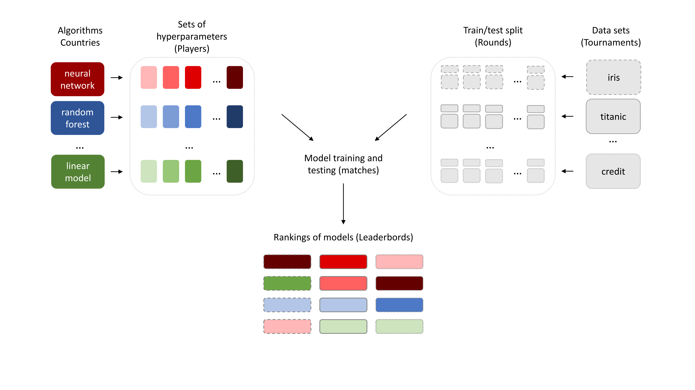

This repository is a landing page for  the article: [Alicja Gosiewska](https://www.linkedin.com/in/alicja-gosiewska/), [Katarzyna Woźnica](https://www.linkedin.com/in/katarzyna-wo%C5%BAnica/), and [Przemysław Biecek](https://www.linkedin.com/in/pbiecek/). *Interpretable Meta-Measure for Model Performance*. 


# Abstract 

*Measures for evaluation of model performance play an important role in Machine Learning. However, the most common performance measures share several limitations. The difference in performance for two models has no probabilistic interpretation and there is no reference point to indicate whether they represent a significant improvement. What is more, it makes no sense to compare such differences between data sets. In this article, we introduce a new meta-measure for performance assessment named Elo-based Predictive Power (EPP). The differences in EPP scores have probabilistic interpretation and can be directly compared between data sets. We prove the mathematical properties of EPP and support them with empirical results of a large scale benchmark on 30 classification data sets. Finally, we show applications of EPP to the selected meta-learning problems and challenges beyond ML benchmarks.*

# Proposed method

An important part of our article is the concept of Elo-based model ranking. We describe the ratings of models as an analogy to the tournaments with the Elo system. Each data set (tournament) is processed independently. Algorithms (countries) are staging their sets of hyperparameters (players) for duels. These duels are held within the data sets (tournaments) divided into train/test splits (rounds).




# Preprint

Preprint for this work is avaliable at https://arxiv.org/abs/2006.02293.

In order to cite our work please use the following BiBTeX entry

```
@misc{gosiewska2020interpretable,
      title={Interpretable Meta-Measure for Model Performance}, 
      author={Alicja Gosiewska and Katarzyna Woznica and Przemyslaw Biecek},
      year={2020},
      eprint={2006.02293},
      archivePrefix={arXiv},
      primaryClass={cs.LG},
      URL={https://arxiv.org/abs/2006.02293}
}
```